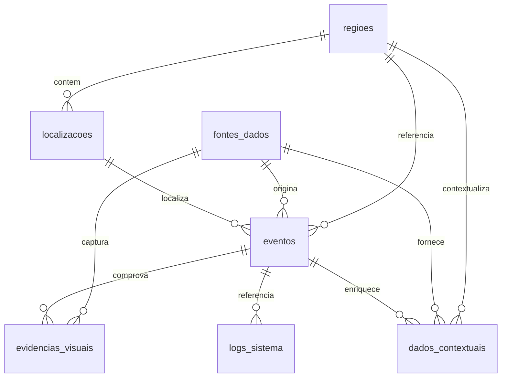

# MotSP — Monitoramento Urbano de São Paulo

Sistema de detecção e monitoramento de eventos urbanos em tempo real, desenvolvido como TCC.
O sistema observa câmeras públicas da CET-SP com visão computacional (YOLO), cruza o que
vê com fontes de dados independentes (trânsito, clima, avisos oficiais, histórico de
alagamento da via) e publica no painel apenas o que sobrevive a esse cruzamento.

> **Este arquivo é a documentação única do sistema.** Ele substitui os antigos
> `PROJECT_STATE.md`, `CODE_OVERVIEW.md`, `database/ERD.md`, `ml/README.md` e
> `data_fusion/README.md`, que foram removidos. Se você é um agente/LLM lendo o
> repositório pela primeira vez: leia este arquivo inteiro antes do código.

---

## Índice

1. [O que o sistema faz (e o que ele não faz)](#1-o-que-o-sistema-faz-e-o-que-ele-não-faz)
2. [Arquitetura e fluxo de dados](#2-arquitetura-e-fluxo-de-dados)
3. [Estrutura de diretórios](#3-estrutura-de-diretórios)
4. [Como rodar](#4-como-rodar)
5. [Configuração (`.env`)](#5-configuração-env)
6. [Banco de dados](#6-banco-de-dados)
7. [API HTTP](#7-api-http)
8. [Tempo real: WebSocket, SSE e polling](#8-tempo-real-websocket-sse-e-polling)
9. [Visão computacional (YOLO)](#9-visão-computacional-yolo)
10. [Detecção contínua de trânsito](#10-detecção-contínua-de-trânsito)
11. [Detecção contínua de alagamento](#11-detecção-contínua-de-alagamento)
12. [Data Fusion (confiabilidade)](#12-data-fusion-confiabilidade)
13. [Ciclo de vida de um evento](#13-ciclo-de-vida-de-um-evento)
14. [Fontes de dados externas](#14-fontes-de-dados-externas)
15. [Frontend](#15-frontend)
16. [Treino do modelo de alagamento](#16-treino-do-modelo-de-alagamento)
17. [Testes](#17-testes)
18. [Segurança e limitações](#18-segurança-e-limitações)
19. [Decisões de escopo (o que foi removido e por quê)](#19-decisões-de-escopo-o-que-foi-removido-e-por-quê)
20. [Referências técnicas](#20-referências-técnicas)

---

## 1. O que o sistema faz (e o que ele não faz)

### Faz

- **Detecta sozinho.** Threads de monitoramento baixam periodicamente o snapshot JPEG de
  10 câmeras públicas da CET-SP e rodam YOLO em cima. Dois tipos de evento urbano estão
  no escopo: **trânsito** (congestionamento) e **alagamento**.
- **Cruza com fontes independentes.** Nenhum evento nasce só do que a câmera viu. Trânsito
  é arbitrado pela velocidade real do trecho (TomTom Traffic API); alagamento é corroborado
  por chuva medida (Open-Meteo), aviso oficial ativo (INMET) e o histórico de alagamento
  daquela via (CGE-SP/GeoSampa, camada estática).
- **Pontua a confiabilidade.** O módulo Data Fusion combina IA (40%), contexto/clima (30%)
  e fonte oficial (30%) num score 0–1. Um evento só é promovido a `ativo` no painel quando
  cruza o limiar (padrão 80%); abaixo disso fica `em_analise`.
- **Publica em tempo real.** Toda criação, atualização e remoção de evento é transmitida
  por WebSocket, com fallback automático para SSE e depois polling.
- **Expira sozinho.** "Tempo real" é literal: um evento vive no máximo 45 minutos após a
  última detecção. Passou disso, é apagado do banco e removido do painel.

### Não faz

- **Não notifica ninguém.** Não há e-mail, SMS, push ou webhook. O sistema detecta e mostra
  no painel; avisar terceiros nunca foi implementado (a tabela `notificacoes` foi removida
  na migração `005` — nada jamais a preencheu).
- **Não tem login.** Sem usuários, perfis, sessão ou trilha por operador (removido na
  migração `003`). Os eventos nascem de câmera, não de gente.
- **Não aceita registro manual de ocorrência.** O painel é somente leitura: não existe rota
  que crie, altere ou remova evento/evidência por requisição de operador. A única entrada
  de evento por HTTP é `POST /deteccao/confirmar`, que repete a inferência YOLO no servidor
  antes de gravar qualquer coisa.
- **Não detecta buraco, incêndio, lixo, árvore caída ou vazamento.** Todas essas classes
  saíram do escopo (ver [§19](#19-decisões-de-escopo-o-que-foi-removido-e-por-quê)).
- **Não usa dado em lote.** Fontes que republicam ocorrências semanas ou anos depois
  (GeoSampa/Defesa Civil como gatilho) foram removidas: o evento saía carimbado com o
  horário em que o sistema notou o registro, não com o horário do incidente.

### Números atuais (verificados)

| Item | Valor |
|---|---|
| Testes de backend (pytest) | **165 passando** |
| Testes de frontend (node:test) | **8 passando** |
| Models SQLAlchemy | 8 |
| Routers FastAPI | 11 (+ 2 endpoints WebSocket) |
| Tabelas no banco | 7 |
| Câmeras CET-SP catalogadas | 10 |
| Pontos de alagamento históricos | 20 |
| `frontend/src/app.ts` | 2.472 linhas |
| `frontend/css/style.css` | 3.487 linhas |

---

## 2. Arquitetura e fluxo de dados

```text
        ┌──────────────────────── FONTES AO VIVO ────────────────────────┐
        │                                                                │
  Câmeras CET-SP          TomTom Traffic       Open-Meteo        INMET avisos
  (10 snapshots JPEG)     (velocidade via)     (chuva, AQI)      (aviso oficial)
        │                        │                  │                  │
        ▼                        │                  │                  │
  ┌───────────────────────────┐  │                  │                  │
  │ live_detection.py         │  │                  │                  │
  │  YOLO11m COCO → contagem  │◄─┘                  │                  │
  │  de veículos              │                     │                  │
  ├───────────────────────────┤                     │                  │
  │ flood_detection.py        │◄────────────────────┴──────────────────┘
  │  gx-incident.pt →         │
  │  classe "alagamento"      │      + data_fusion/historico_alagamento.py
  └───────────┬───────────────┘        (prior espacial ESTÁTICO, lookup local)
              │
              ▼
   ┌────────────────────────────────────────────────┐
   │ detection_events.registrar_deteccao()          │
   │  · grava JPEG original + cópia com caixas YOLO │
   │  · SHA-256 do original (auditoria)             │
   │  · cria Localizacao + Evento (em_analise)      │
   │  · cria EvidenciaVisual                        │
   │  · grava DadoContextual (clima/índices)        │
   └───────────┬────────────────────────────────────┘
               │
               ▼
   ┌────────────────────────────────────────────────┐
   │ data_fusion/  ──►  confiabilidade 0..1         │
   │  IA 40% · clima/contexto 30% · fonte oficial 30│
   │  ≥ 0,80 → status vira "ativo"                  │
   └───────────┬────────────────────────────────────┘
               │
               ▼
   ┌───────────────────────────┐        ┌──────────────────────────────┐
   │ FastAPI (REST + WS + SSE) │───────►│ Frontend TypeScript          │
   │ SQLAlchemy → SQLite/MySQL │        │ Leaflet + GeoSampa WMS       │
   └───────────┬───────────────┘        │ WS ─► SSE ─► polling (15s)   │
               │                        └──────────────────────────────┘
               ▼
   ┌────────────────────────────────────────────────┐
   │ event_retention (loop a cada 120 s)            │
   │  · purga eventos fora da janela de 45 min      │
   │  · colapsa duplicados no mesmo ponto           │
   │  · promove/rebaixa por confiabilidade          │
   └────────────────────────────────────────────────┘
```

**Princípio central do projeto:** o YOLO produz *evidência*, não *veredito*. A decisão de
mostrar um evento como real vem sempre do cruzamento no Data Fusion.

---

## 3. Estrutura de diretórios

```text
TCC-Atualizado/
├── README.md                     ← este arquivo (documentação única)
├── package.json                  build/test do frontend (tsc + node:test)
├── start.ps1                     sobe backend (8000) e frontend (5500) em janelas separadas
├── reset_mysql.ps1 / .bat        reset da senha root do MySQL local (utilitário de máquina)
│
├── backend/
│   ├── requirements.txt          FastAPI, SQLAlchemy, Pydantic, Pillow, pytest…
│   ├── requirements-yolo.txt     + ultralytics (só na máquina que roda/treina o modelo)
│   ├── .env.example              todas as variáveis, com o racional de cada uma
│   ├── cleanup_demo_data.py      remove o seed demonstrativo legado do SQLite (com backup)
│   ├── app/
│   │   ├── main.py               app FastAPI, lifespan, loop de manutenção (120 s)
│   │   ├── config.py             Settings (pydantic-settings) — fonte única de configuração
│   │   ├── database.py           engine, SessionLocal, Base, PRAGMA WAL para SQLite
│   │   ├── broadcast.py          agenda coroutines no loop principal a partir de threads
│   │   ├── ws_manager.py         ConnectionManager + WSMessage (protocolo WebSocket)
│   │   ├── models/               8 models SQLAlchemy (um arquivo por entidade)
│   │   ├── schemas/              schemas Pydantic (Literal[] para enums)
│   │   ├── routers/              11 routers (ver §7)
│   │   ├── services/
│   │   │   ├── live_detection.py        detecção contínua de TRÂNSITO (thread/câmera)
│   │   │   ├── flood_detection.py       detecção contínua de ALAGAMENTO (thread/câmera)
│   │   │   ├── detection_events.py      persiste evento + evidência e faz o broadcast
│   │   │   ├── event_retention.py       purga, colapsa duplicados
│   │   │   ├── data_fusion_service.py   ponte app ↔ data_fusion; promove/rebaixa status
│   │   │   ├── cet_camera_catalog.py    catálogo das 10 câmeras + checagem de frescor
│   │   │   ├── tomtom_traffic_source.py velocidade atual × livre do trecho
│   │   │   ├── weather_source.py        Open-Meteo (clima e qualidade do ar)
│   │   │   ├── inmet_alert_source.py    avisos meteorológicos oficiais ativos
│   │   │   ├── visual_validation.py     valida frame sem persistir (dedup + limites)
│   │   │   └── evidence_annotation.py   desenha as caixas YOLO sobre a evidência
│   │   └── data/evidencias/      JPEGs gravados em runtime (fora do git)
│   └── tests/                    165 testes pytest (SQLite em memória)
│
├── data_fusion/                  motor de confiabilidade (puro Python, sem FastAPI)
│   ├── fusion.py                 combinação ponderada das dimensões
│   ├── scores.py                 pontuação por dimensão e por tipo de evento
│   ├── models.py                 dataclasses de entrada/saída
│   ├── historico_alagamento.py   prior espacial estático (lookup local, sem rede)
│   ├── data/pontos_alagamento_sp.json   20 pontos CGE-SP/GeoSampa
│   ├── test_fusion.py            `python -m data_fusion.test_fusion`
│   └── test_historico_alagamento.py
│
├── ml/
│   ├── detector.py               carrega os DOIS modelos YOLO, normaliza classes
│   ├── train_incident_model.py   inspect/download/merge/train do modelo de alagamento
│   ├── collect_negatives.py      coleta frames CET-SP como negativos de treino
│   ├── models/                   pesos .pt (fora do git)
│   ├── datasets/ · runs/         datasets e runs de treino (fora do git)
│
├── database/
│   ├── schema.sql                DDL MySQL das 7 tabelas + seed mínimo
│   └── migrations/               001…005 (ver §6)
│
└── frontend/
    ├── index.html                SPA com ARIA, views, drawer de detalhe, overlays
    ├── css/style.css             design tokens, dark theme sólido
    ├── js/config.js              API_BASE_URL, centro/zoom do mapa (fora do git)
    ├── js/config.example.js      modelo do arquivo acima
    ├── src/                      TypeScript fonte
    │   ├── app.ts                aplicação inteira (mapa, tempo real, YOLO, fusão)
    │   ├── fusion-format.ts      formatação e limiar de promoção (espelha o backend)
    │   ├── event-detail-format.ts
    │   └── event-actions-format.ts
    ├── dist/                     saída do `tsc` (versionada)
    └── tests/                    8 testes node:test dos módulos puros
```

---

## 4. Como rodar

### Pré-requisitos

- **Python 3.11+**
- **Node.js 18+** (apenas para compilar o TypeScript)
- **MySQL 8.x** opcional — sem `DATABASE_URL` configurada, o sistema usa SQLite local
  (`backend/gx.db`) e cria as tabelas sozinho no startup
- Para inferência real: `backend/requirements-yolo.txt` + os pesos em `ml/models/`
  (`yolo11m.pt` para trânsito, `gx-incident.pt` para alagamento — não versionados)

### Caminho rápido (Windows)

```powershell
.\start.ps1
```

Sobe o backend em `http://localhost:8000` e o frontend em `http://localhost:5500`, cada um
na sua janela do PowerShell, e abre o navegador.

> `start.ps1` chama o uvicorn direto, **sem exportar variável de ambiente nenhuma**. Toda
> configuração precisa estar em `backend/.env` — é por isso que `config.py` é a única
> leitora de configuração no projeto (ver a nota sobre `TOMTOM_API_KEY` em [§5](#5-configuração-env)).

### Caminho manual

```bash
# 1) Frontend (compilar TypeScript)
npm install
npm run build:frontend          # src/ → dist/

# 2) Backend
cd backend
python -m venv venv
venv\Scripts\activate           # Windows
pip install -r requirements.txt
copy .env.example .env          # e edite
uvicorn app.main:app --reload --host 0.0.0.0 --port 8000

# 3) Servir o frontend
cd ..
npm run serve:frontend          # http://localhost:5500
```

Copie também `frontend/js/config.example.js` para `frontend/js/config.js` e ajuste
`API_BASE_URL` se o backend não estiver em `http://127.0.0.1:8000`.

### Inferência YOLO real

```bash
cd backend
venv\Scripts\python -m pip install -r requirements-yolo.txt
```

Coloque os pesos em `ml/models/` e confirme com `GET /deteccao/status` antes de enviar
imagens. Sem os pesos, a API responde indisponibilidade explicitamente em vez de fingir
que detectou algo.

### Ligar o monitoramento automático

Desligado por padrão, **inclusive nos testes** (evita threads de rede real subindo sozinhas).
No `.env`:

```env
GX_MONITORAMENTO_ATIVO=true
GX_TRANSITO_MONITORAR_CATALOGO=true      # 10 threads de trânsito
GX_ALAGAMENTO_MONITORAR_CATALOGO=true    # 10 threads de alagamento (exige gx-incident.pt)
TOMTOM_API_KEY=...                       # sem ela, parte da lógica de trânsito degrada
```

---

## 5. Configuração (`.env`)

Todas as variáveis são lidas por `backend/app/config.py` (pydantic-settings). Prefixo `GX_`
é herança do nome antigo do projeto e foi mantido para não quebrar ambientes existentes.

### Infraestrutura

| Variável | Padrão | O que faz |
|---|---|---|
| `DATABASE_URL` | `sqlite:///./gx.db` | Conexão SQLAlchemy. Se contiver as credenciais de exemplo (`usuario:senha@` / `root:senha@`), um validador força SQLite — evita que um `.env` copiado sem editar deixe a API inutilizável. |
| `API_HOST` / `API_PORT` | `0.0.0.0` / `8000` | Bind do uvicorn. |
| `CORS_ORIGINS` | `localhost:5500,127.0.0.1:5500,localhost:8080` | Lista separada por vírgula. **Não é autenticação** — só restringe origens de navegador. |

### Modelos YOLO

| Variável | Padrão | O que faz |
|---|---|---|
| `GX_YOLO_MODEL` | `ml/models/yolo11m.pt` | Peso COCO para contagem de veículos. `m` e não `n`/`s`: o nano/small perdiam carro pequeno, distante e noturno. |
| `GX_YOLO_IMGSZ` | `1280` | Resolução de inferência do modelo de trânsito. Em 640 (padrão do Ultralytics) o YOLO subconta ~35% da fila ao fundo. Custo em GPU: dezenas de ms. |
| `YOLO_THRESHOLD` | `0.45` | Confiança mínima do modelo de objetos. |
| `GX_YOLO_INCIDENT_MODEL` | `ml/models/gx-incident.pt` | Peso dedicado a alagamento, carregado **separado** do modelo padrão (trocar o global quebraria a contagem de veículos). |
| `GX_YOLO_INCIDENT_CONF` | `0.6` | Confiança mínima só do modelo de alagamento. Mais alta de propósito: enquanto o peso não é retreinado com negativos, ele crava caixa em cena seca com score baixo. |
| `GX_YOLO_CLASS_MAPPING` | — | JSON opcional, ex.: `{"car":"veiculo","truck":"caminhao"}`. Destinos inválidos são ignorados para não converter classe desconhecida em ocorrência urbana. |

### Validação de frame (upload / câmera do navegador)

| Variável | Padrão | O que faz |
|---|---|---|
| `YOLO_MAX_FPS` | `3` | Teto de frames por segundo aceitos no WebSocket `/ws/cv`. |
| `YOLO_MAX_FRAME_BYTES` | `1500000` | Tamanho máximo de um frame. |
| `YOLO_MAX_FRAME_WIDTH` | `1280` | Largura máxima esperada. |
| `YOLO_COOLDOWN_SECONDS` | `20` | Janela de deduplicação: mesma classe + mesma bbox dentro disso é marcada `duplicada`. |

### Monitoramento contínuo

| Variável | Padrão | O que faz |
|---|---|---|
| `GX_MONITORAMENTO_ATIVO` | `false` | Chave mestra. Sem ela, **nenhuma** thread de detecção sobe. |
| `GX_TRANSITO_MONITORAR_CATALOGO` | `false` | Liga uma thread de trânsito por câmera do catálogo (10). |
| `GX_ALAGAMENTO_MONITORAR_CATALOGO` | `false` | Liga uma thread de alagamento por câmera do catálogo (10). |
| `GX_CAMERA_SNAPSHOT_URL` | — | Câmera avulsa (útil para testar com URL controlada). Exige lat/lon. |
| `GX_CAMERA_LATITUDE` / `_LONGITUDE` | — | Coordenada da câmera avulsa. |
| `GX_LIVE_DETECTION_INTERVAL_SECONDS` | `5` | Intervalo entre downloads de snapshot. |
| `GX_CAMERA_FRESCOR_MAXIMO_SEGUNDOS` | `300` | Idade máxima do `Last-Modified` para o frame contar como "ao vivo". Ver [§9](#a-armadilha-do-frame-travado). |

### Gatilho de trânsito (as três faixas)

| Variável | Padrão | O que faz |
|---|---|---|
| `GX_TRANSITO_MIN_VEICULOS_CORROBORADO` | `4` | **Piso absoluto.** Abaixo disso o frame é descartado sem nem consultar a TomTom. |
| `GX_TRANSITO_MIN_VEICULOS` | `12` | Contagem a partir da qual o frame se sustenta sem corroboração externa (mas ainda pode ser vetado). |
| `GX_TRANSITO_MIN_VEICULOS_CONFIRMADO` | `16` | Contagem que cria o evento sozinha, sem consultar ninguém. |
| `GX_TRANSITO_TOMTOM_INDICE_MINIMO` | `3.0` | Índice de congestionamento (0–10) que a TomTom precisa reportar na faixa intermediária. Abaixo disso (trecho a ≥ ~70% da velocidade livre) ela veta. |
| `TOMTOM_API_KEY` | — | Chave da TomTom Traffic API (cadastro gratuito self-service). |

> **Por que `TOMTOM_API_KEY` passa por `config.py` e não por `os.getenv`:** o `.env` é lido
> pelo pydantic-settings, que popula o objeto `Settings` mas **não** o `os.environ` do
> processo. Enquanto o serviço lia `os.getenv` direto, a chave configurada no `.env` nunca
> chegava nele e toda consulta caía em "TOMTOM_API_KEY não configurada" em silêncio —
> porque `start.ps1` sobe o uvicorn sem exportar variável nenhuma.

### Cooldowns e ciclo de vida

| Variável | Padrão | O que faz |
|---|---|---|
| `GX_ALERTA_COOLDOWN_SECONDS` | `1800` (30 min) | Silêncio da câmera depois de um evento **criado**. |
| `GX_TRANSITO_VETO_COOLDOWN_SECONDS` | `600` (10 min) | Silêncio depois de um **veto** da TomTom. Curto de propósito: um veto às 19h00 não pode calar a câmera até 19h30 se a via travar no meio do caminho. Também é o teto de consumo da API: 1 consulta por câmera a cada 10 min ≈ 1,4 k chamadas/dia nas 10 câmeras, dentro do plano gratuito. |
| `GX_EVENTO_JANELA_MINUTOS` | `45` | Janela de "tempo real". Evento detectado antes disso é apagado do banco. Mantido acima do cooldown de alerta para não abrir buraco entre uma detecção e a próxima. |
| `GX_FUSION_AUTO_ATIVO_MIN` | `0.80` | Confiabilidade a partir da qual um evento `em_analise` é promovido a `ativo`. |

---

## 6. Banco de dados

MySQL 8 em produção (`database/schema.sql`), SQLite em desenvolvimento e testes. Com SQLite,
`main.py` cria as tabelas no startup e `database.py` liga `PRAGMA journal_mode=WAL` +
`busy_timeout=30000` — as threads de monitoramento escrevem em paralelo com as requisições
HTTP e sem isso o SQLite erra `database is locked`.

### Diagrama entidade-relacionamento



### Tabelas

| Tabela | Model | Função |
|---|---|---|
| `regioes` | `Regiao` | Divisão geográfica da cidade (nome, código, polígono GeoJSON opcional). |
| `localizacoes` | `Localizacao` | Coordenadas + endereço. A detecção cria uma localização 1:1 por evento; a retenção apaga as órfãs. |
| `fontes_dados` | `FonteDados` | Origem do dado: `sensor`, `api`, `yolo`, `data_fusion`, `manual`. O **tipo** é o que o Data Fusion usa para pontuar a dimensão "fonte oficial". |
| `eventos` | `Evento` | Ocorrência urbana. Campos-chave: `tipo`, `severidade`, `status`, `confianca` (score do Data Fusion), `detectado_em`. |
| `evidencias_visuais` | `EvidenciaVisual` | Imagem/frame + `modelo_ia`, `classe_detectada`, `confianca`, `bbox` e SHA-256 do original em `metadados`. |
| `dados_contextuais` | `DadoContextual` | Pares chave/valor por evento. Categoria `clima` alimenta a dimensão de contexto da fusão. |
| `logs_sistema` | `LogSistema` | Diagnóstico. Cada recálculo de fusão grava aqui os componentes e se houve promoção/rebaixamento. |
| — | `OcorrenciaExterna` | Model remanescente do rastreio de datasets externos (tabela criada pela migração `002`; sem produtor ativo desde a remoção do GeoSampa como gatilho). |

### Enums do domínio

- **Severidade**: `baixa` · `media` · `alta` · `critica`
- **Status do evento**: `ativo` · `em_analise` · `resolvido`
- **Tipo de evidência**: `imagem` · `video` · `frame` · `thumbnail`
- **Nível de log**: `DEBUG` · `INFO` · `WARN` · `ERROR` · `CRITICAL`

Validados como `Literal[...]` nos schemas Pydantic (`backend/app/schemas/evento.py`), então
um valor fora da lista é rejeitado com 422 antes de chegar ao banco.

### Migrações (`database/migrations/`)

| Arquivo | Tipo | O que faz |
|---|---|---|
| `001_security.sql` | aditiva | Criava `usuarios` e `auditoria_acoes`. **Histórica** — a camada de autenticação foi removida depois. |
| `002_ocorrencias_externas.sql` | aditiva | Cria `ocorrencias_externas` (dedup de datasets externos). |
| `003_remove_auth.sql` | **destrutiva** | Dropa `auditoria_acoes` e depois `usuarios` (nessa ordem — FK). Reverter = reaplicar a `001`; os dados não voltam. |
| `004_painel_somente_leitura.sql` | **destrutiva** | Dropa `logs_sistema.ip_origem`, que existia para rastrear ação de usuário e nunca foi preenchida. |
| `005_remove_notificacoes.sql` | **destrutiva** | Dropa `notificacoes`. Nada no sistema jamais a preencheu. |

O `schema.sql` **não popula eventos, evidências nem dados contextuais** — só regiões, três
fontes de dados e uma linha de log. Registros de ocorrência só entram por detecção real.

---

## 7. API HTTP

Documentação interativa em `http://localhost:8000/docs` (Swagger, gerado pelo FastAPI).

### Serviço

| Método | Rota | Descrição |
|---|---|---|
| GET | `/` | Status da API. |
| GET | `/health` | Health check (`{"status":"ok"}`). |

### Eventos — somente leitura

| Método | Rota | Parâmetros |
|---|---|---|
| GET | `/eventos` | `status`, `tipo`, `limite` (1–500, padrão 100), `janela_minutos` (0 = histórico completo; padrão = `GX_EVENTO_JANELA_MINUTOS`) |
| GET | `/eventos/{id}` | — |

Por padrão a listagem só retorna eventos detectados dentro da janela de 45 minutos: é um
quadro ao vivo, não um histórico.

### Data Fusion

| Método | Rota | Descrição |
|---|---|---|
| GET | `/fusion/eventos/{id}/confiabilidade` | Calcula sem gravar. |
| POST | `/fusion/eventos/{id}/recalcular` | `?persistir=true` (padrão) grava em `eventos.confianca`, ajusta o status e loga. |
| POST | `/fusion/recalcular-todos` | Processa em lote (`?limite=`, `?persistir=`). |

A resposta traz `confiabilidade`, `nivel`, `limiar_ativo` e a lista de `componentes` com
`pontuacao`, `peso`, `contribuicao` e `detalhe` em texto — é isso que o painel exibe como
"por que este evento tem essa confiança".

### Visão computacional

| Método | Rota | Descrição |
|---|---|---|
| GET | `/deteccao/classes` | Classes urbanas mapeadas + aviso sobre limites do peso COCO. |
| GET | `/deteccao/status` | Disponibilidade dos **dois** modelos, caminho dos pesos, erro de carga e `min_veiculos_transito`. |
| POST | `/deteccao/imagem` | Upload → inferência com o modelo de objetos. PNG/JPG/WEBP até 10 MB; arquivo temporário apagado ao final. |
| POST | `/deteccao/incidente` | Upload → inferência com o modelo dedicado de alagamento. Isolado: não passa pelo pipeline de evento/evidência. |
| POST | `/deteccao/frame` | Valida um frame (multipart: `file`, `frame_id`, `threshold`, `evento_id`, `persistir`). Só grava evidência com `persistir=true`, detecção não duplicada e `evento_id` informado. |
| POST | `/deteccao/confirmar` | **Única rota HTTP que cria evento.** Repete a inferência no servidor; classe, confiança, severidade e tipo gravados vêm da nova inferência, não do que o cliente mandou. |
| POST | `/deteccao/simular` | Detecções de demonstração. Não chama modelo nenhum. |
| POST | `/deteccao/video` | Fluxo de demonstração de frames. |

### Consulta de apoio

| Método | Rota | Descrição |
|---|---|---|
| GET | `/evidencias` | Filtros: `evento_id`, `tipo`, `limite`. |
| GET | `/evidencias/{id}` | — |
| GET | `/evidencias/arquivo/{nome}` | Serve o JPEG local; usa `Path(nome).name` para bloquear travessia de diretório. |
| GET | `/logs` | Filtros: `nivel`, `modulo`, `evento_id`, `limite`. |
| GET/POST/DELETE | `/dados-contextuais` | Leitura, ingestão e remoção de dado contextual. |

### Cadastro (CRUD completo)

| Rota | Métodos |
|---|---|
| `/regioes` | GET · GET/{id} · POST · PATCH · DELETE |
| `/fontes` | GET · GET/{id} · POST · PATCH · DELETE |
| `/localizacoes` | GET · GET/{id} · POST · PATCH · DELETE (409 se houver evento vinculado) |

### Fontes externas ao vivo (proxy)

| Método | Rota | Descrição |
|---|---|---|
| GET | `/fontes/tempo-real/clima` | Open-Meteo: temperatura, precipitação, chuva, vento, código do tempo. |
| GET | `/fontes/tempo-real/ar` | Open-Meteo Air Quality: AQI US/europeu, PM2.5, PM10. |

Ambas aceitam `latitude`/`longitude` (padrão: centro de São Paulo).

### Tempo real

| Protocolo | Rota | Descrição |
|---|---|---|
| WS | `/ws` | Canal operacional de eventos. |
| WS | `/ws/cv` | Canal de frames base64 para validação visual (nunca persiste imagem). |
| GET | `/events/stream` | SSE — fallback do WebSocket. |
| GET | `/events/connected` | Número de clientes SSE conectados. |

> **Resumo de escrita:** as únicas rotas que gravam são `/deteccao/confirmar` e
> `/deteccao/frame?persistir=true` (evento/evidência, sempre revalidando no servidor),
> `/dados-contextuais` (ingestão de fonte) e os CRUDs de cadastro `/regioes`, `/fontes`,
> `/localizacoes`. Não existe rota para editar título, status, severidade ou resolver
> evento.

---

## 8. Tempo real: WebSocket, SSE e polling

### Protocolo do `/ws`

Sem handshake: o servidor aceita a conexão e anuncia `{"tipo": "pronto"}` imediatamente.
Toda mensagem é JSON com três campos:

```json
{
  "tipo": "evento_criado",
  "timestamp": "2026-09-04T12:00:00+00:00",
  "dados": { }
}
```

**Servidor → Cliente**

| `tipo` | `dados` | Disparado por |
|---|---|---|
| `pronto` | — | Aceite da conexão. |
| `evento_criado` | `EventoResponse` completo | `detection_events.registrar_deteccao` |
| `evento_atualizado` | `EventoResponse` completo | `detection_events.publicar_evento` — refresco no mesmo ponto, `/deteccao/confirmar`, recálculo da fusão que muda o status |
| `evento_removido` | `{"id": int}` | `event_retention.purgar_eventos_expirados` e `colapsar_eventos_duplicados` |
| `pong` | `{}` | Resposta a `ping` |

**Cliente → Servidor**: apenas `{"tipo":"ping"}`.

### Protocolo do `/ws/cv`

Anuncia `{"tipo":"pronto","max_fps":N}` ao conectar e depois aceita mensagens
`{"tipo":"frame","conteudo":"<base64>","mime":"image/jpeg","frame_id":"…"}`. Acima de
`YOLO_MAX_FPS` responde `frame_ignorado`. Resultado volta como `frame_resultado` com as
detecções, latência e o modo do detector. **Nenhum frame é persistido nesse canal.**

### Como o broadcast atravessa threads

As detecções rodam em threads síncronas, fora do event loop do FastAPI.
`app/broadcast.py` resolve isso: `set_main_loop()` guarda o loop no startup e
`schedule_coroutine()` usa `asyncio.run_coroutine_threadsafe` para agendar o envio.
Se o loop não estiver rodando, a chamada é ignorada silenciosamente (é o que acontece nos
testes, e é intencional).

### Cascata de fallback (frontend)

```text
WebSocket ──falha──► SSE (/events/stream) ──falha──► Polling (15 s)
```

- Reconexão exponencial: 1 s → 2 s → 4 s → … → 128 s (máx. 8 tentativas)
- Ping/pong a cada 30 s para manter a conexão viva
- Timer de ressincronização periódica: recarrega a lista completa mesmo com o canal vivo,
  para não acumular divergência
- Seleção do evento e filtros são preservados durante as atualizações
- Conexões mortas são removidas automaticamente no broadcast

| Estado | Badge | Cor |
|---|---|---|
| `ws` | "Tempo real" | verde |
| `sse` | "Tempo real (SSE)" | azul |
| `polling` | "Polling" | amarelo |
| `disconnected` | "Desconectado" | cinza |

---

## 9. Visão computacional (YOLO)

### Dois modelos, carregados separadamente

`ml/detector.py` mantém **dois** modelos Ultralytics independentes, ambos carregados sob
demanda (a API sobe normalmente em máquina sem GPU e sem pesos):

| Modelo | Variável | Uso | Confiança |
|---|---|---|---|
| Objetos (COCO) | `GX_YOLO_MODEL` → `yolo11m.pt` | Contagem de veículos para trânsito, upload de imagem | `YOLO_THRESHOLD` = 0,45 |
| Incidentes (próprio) | `GX_YOLO_INCIDENT_MODEL` → `gx-incident.pt` | Classe única `alagamento` | `GX_YOLO_INCIDENT_CONF` = 0,6 |

Manter os dois separados é deliberado: substituir o peso global por um treinado em
alagamento faria a contagem de veículos parar de funcionar.

### Classes urbanas (`CLASSES_URBANAS`)

| ID | Nome | Severidade | Tipo |
|---|---|---|---|
| 1 | `alagamento` | critica | clima |
| 2 | `transito` | media | mobilidade |
| 8 | `veiculo` | baixa | **observacao_visual** |
| 9 | `motocicleta` | baixa | observacao_visual |
| 10 | `onibus` | baixa | observacao_visual |
| 11 | `caminhao` | baixa | observacao_visual |
| 12 | `hidrante` | baixa | observacao_visual |

Os IDs 0, 3, 4, 5, 6 e 7 pertenciam a `buraco`, `lixo`, `incendio`, `construcao_irregular`,
`arvore_caida` e `vazamento` — removidos do escopo e **não reaproveitados**.

**`observacao_visual` é uma categoria de honestidade.** O peso COCO reconhece que existe um
carro no quadro; isso não é um congestionamento. Detecções COCO viram eventos com título
"Observação YOLO: …" e descrição explícita de que comprovam a presença do objeto, não um
incidente urbano. Só o pipeline de contagem (§10) transforma N veículos em um evento
`transito`.

O mapeamento COCO→urbano é `car→veiculo`, `motorcycle→motocicleta`, `bus→onibus`,
`truck→caminhao`, `fire hydrant→hidrante`, extensível por `GX_YOLO_CLASS_MAPPING`. Classes
sem destino válido são **descartadas** — é assim que um peso antigo treinado também com
`arvore_caida` continua funcionando sem gerar eventos dessa classe.

### Validação de frame (`visual_validation.py`)

Camada usada por `/deteccao/frame`, `/deteccao/confirmar` e `/ws/cv`:

1. Valida MIME (`image/jpeg`, `image/png`, `image/webp`), tamanho e threshold
2. Grava em arquivo temporário, roda o detector, **apaga o temporário**
3. Marca como `duplicada` toda detecção com a mesma classe + bbox vista há menos de
   `YOLO_COOLDOWN_SECONDS`
4. Devolve `frame_id`, detecções, timestamp, `latencia_ms`, `relevante` e `modo`

### Evidência auditável

Quando um evento é criado (`detection_events.registrar_deteccao`), o sistema grava:

- `{uuid}-original.jpg` — o frame exatamente como veio
- `{uuid}-yolo.jpg` — cópia com as caixas desenhadas (`evidence_annotation.py`)
- `sha256_original` nos metadados da evidência
- `classe_modelo` (o nome bruto do modelo, ex.: `car`) ao lado da classe urbana normalizada

Se a anotação visual falhar, o original continua sendo a evidência — a inferência já
aconteceu e o registro não se perde.

### A armadilha do frame travado

A CET-SP não expõe RTSP: cada câmera é um JPEG estático num endpoint por ID
(`https://cameras.cetsp.com.br/Cams/{id}/1.jpg`), atualizado pelo servidor deles. Em
26/08/2026 descobriu-se que a câmera 22 ("Paulista - Metrô Consolação") havia travado:
respondia **200 OK com bytes válidos**, mas sempre o mesmo JPEG de meses atrás. Sem
verificação, isso produz um evento "detectado agora" com uma foto de outra época — o oposto
de tempo real.

Por isso **toda** detecção contínua passa por `cet_camera_catalog.frame_esta_desatualizado`,
que lê o cabeçalho HTTP `Last-Modified` e descarta o frame se ele for mais velho que
`GX_CAMERA_FRESCOR_MAXIMO_SEGUNDOS` (300 s). Câmeras que não enviam `Last-Modified` são
tratadas como frescas — não dá para provar o contrário. A câmera 22 acabou removida do
catálogo em 04/09/2026 (a 23 fica a ~50 m e cobre o mesmo cruzamento), mas a checagem
continua valendo para todas: qualquer outra pode travar do mesmo jeito.

---

## 10. Detecção contínua de trânsito

`backend/app/services/live_detection.py` — uma thread por câmera, cada uma com cooldown
independente (uma avenida congestionada não pode silenciar o alerta de outra).

### O loop

1. `GET` no snapshot a cada `GX_LIVE_DETECTION_INTERVAL_SECONDS` (5 s)
2. Descarta se o `Last-Modified` estiver velho
3. Descarta se o SHA-256 for igual ao do frame anterior (nada mudou)
4. Roda o modelo de objetos e conta detecções em `{veiculo, motocicleta, onibus, caminhao}`
5. Aplica o gatilho de três faixas
6. Se criar: reduz as N detecções a **uma** detecção sintética de `transito`

### Por que contagem sozinha não basta

O YOLO/COCO não tem classe "trânsito" — só objetos. Contar veículos no quadro é a
aproximação disponível, e ela erra para os dois lados:

- **Superconta:** o enquadramento pega os dois sentidos da via + a fila da transversal. Uma
  avenida larga fluindo normalmente passa de 12 veículos à toa.
- **Subconta:** o JPEG noturno da câmera pública derruba o score do YOLO. Uma via
  comprovadamente parada às 19h fica em 4–7 veículos detectados.

### O gatilho de três faixas (`_avaliar_gatilho_transito`)

| Contagem no frame | Quem decide | Resultado |
|---|---|---|
| `≥ 16` (`_CONFIRMADO`) | Ninguém — a contagem basta | **Cria.** Frame muito cheio é sinal forte por si só. |
| `12..16` | TomTom pode **vetar** | Cria, exceto se a TomTom medir o trecho a ≥ ~70% da velocidade livre (índice < 3,0). Sem `TOMTOM_API_KEY`, volta a decidir só por contagem. |
| `4..12` (`_CORROBORADO`..`_MIN`) | TomTom **cria** | A contagem é baixa demais para se sustentar; só vira evento se a TomTom corroborar lentidão. Sem chave, esta faixa não gera nada. |
| `< 4` | — | Descartado sem consultar a TomTom. Abaixo disso não há aglomeração visível que sustente a evidência anexada ao evento, por mais lento que o trecho esteja. |

Atalho adicional: `roadClosure=true` da TomTom cria o evento independentemente da contagem.

> **O caso que motivou a faixa baixa (04/09/2026, rush das 19h):** a via estava a 9 km/h num
> trecho de 20 km/h livres, a TomTom sabia disso, e o portão de contagem barrava o frame
> *antes* de perguntar a ela. A fonte que sabia da lentidão nunca era ouvida. Hoje o portão
> inicial é o **piso** (4), não o mínimo (12).

### Confiança da detecção sintética

A confiança do evento de trânsito é a média das **`GX_TRANSITO_MIN_VEICULOS` maiores**
confianças, não de todas: veículos ao fundo aparecem pequenos e com score naturalmente
baixo, e a média de todos derrubava a dimensão de IA da fusão mesmo com congestionamento
óbvio no primeiro plano. O que importa é "há N veículos bem detectados juntos", não a
qualidade média de cada lata distante. A bbox do evento é a união das bboxes dos veículos.

### Deduplicação em duas camadas

- **Em memória:** cooldown por thread (30 min após criar, 10 min após veto). Perde-se a cada
  restart do servidor.
- **No banco:** `refrescar_evento_no_ponto` procura um evento vivo do mesmo tipo no mesmo
  ponto (tolerância 1e-4°) dentro da janela. Se achar, só renova o `detectado_em` e publica
  `evento_atualizado`, em vez de empilhar outro evento — e nem gasta chamada da TomTom.

### Dados contextuais gravados

| Chave | Origem |
|---|---|
| `indice_congestionamento` | `min(10, n_veiculos / 2)` — índice derivado da contagem |
| `indice_congestionamento_tomtom` | `10 × (1 − velocidade_atual / velocidade_livre)` |

Quando ambos existem, o Data Fusion usa a **média** — duas fontes concordando valem mais
que uma.

---

## 11. Detecção contínua de alagamento

`backend/app/services/flood_detection.py` — mesmo padrão do trânsito (thread por câmera,
mesmo catálogo, mesma checagem de frescor), mas rodando o modelo dedicado de incidentes
direto no snapshot.

Sem `GX_YOLO_INCIDENT_MODEL` configurado, o loop sobe mas cada frame é descartado
silenciosamente — mesmo comportamento defensivo do resto do sistema quando falta peso
treinado.

Detectado um `alagamento`, o serviço busca três insumos e grava todos como
`dados_contextuais` de categoria `clima`:

| Insumo | Chave | Natureza |
|---|---|---|
| Chuva no ponto exato (Open-Meteo) | `precipitacao_mm_h` | Sensor bruto, **ao vivo** |
| Aviso ativo do INMET para São Paulo | `alerta_inmet_severidade` | Julgamento institucional, **ao vivo**. Só gravado se o texto de "riscos" mencionar alagamento/inundação/enchente. |
| Histórico de alagamento da via | `historico_alagamento_indice` | Prior espacial **estático**, lookup local sem rede. Gravado **sempre**, inclusive `0.0`. |

Gravar o histórico mesmo quando é zero é o que permite ao Data Fusion distinguir
"via sem histórico" (sinal negativo real) de "sem informação" (chave ausente).

Uma nota de escopo importante: o alagamento **não** tem um equivalente ao veto da TomTom.
As fontes climáticas entram depois da criação do evento, calibrando a confiabilidade — e é
a confiabilidade que decide se ele aparece como `ativo` ou fica `em_analise`.

---

## 12. Data Fusion (confiabilidade)

Módulo `data_fusion/`, Python puro e sem dependência do FastAPI — pode ser testado isolado.

### As três dimensões

| Dimensão | Peso | Fonte |
|---|---|---|
| **IA** | 40% | `evidencias_visuais` — a melhor confiança YOLO do evento, mais o fato de haver modelo registrado |
| **Clima / contexto** | 30% | `dados_contextuais` com `categoria = clima` |
| **Fonte oficial** | 30% | `fontes_dados.tipo` do evento |

### Normalização de peso

Uma dimensão que pontua `0` significa "não utilizada", não "ruim". O peso dela é
redistribuído entre as demais:

```python
peso_disponivel = soma dos pesos das dimensões com pontuação > 0
peso_efetivo(d) = PESO[d] / peso_disponivel
confiabilidade  = Σ pontuacao(d) × peso_efetivo(d)
```

Um evento com evidência YOLO e clima, mas sem fonte independente, pode chegar a 100% — o
peso da fonte oficial é redistribuído entre IA (57%) e clima (43%).

### Níveis

| Confiabilidade | Nível |
|---|---|
| ≥ 0,80 | `alta` |
| 0,55 – 0,79 | `media` |
| < 0,55 | `baixa` |

### Pontuação da dimensão "fonte oficial"

| Tipo da fonte | Pontuação | Observação |
|---|---|---|
| `api` | 0,92 | ×0,85 se a fonte estiver inativa |
| `data_fusion` | 0,88 | |
| `sensor` | 0,85 | |
| `manual` | 0,50 | "validação oficial pendente" |
| `yolo` | **0,00** | Já contabilizado na dimensão IA — não pode contar duas vezes |
| outro | 0,45 | |

> Consequência prática: **todo evento autônomo tem fonte `yolo`**, então essa dimensão hoje
> pontua 0 e seu peso é redistribuído. Foi exatamente essa lacuna que motivou trazer o INMET
> — um julgamento institucional que se aproxima do papel que essa dimensão deveria cumprir.

### Pontuação da dimensão "clima", por tipo de evento

**Alagamento** — combina até três insumos:

```text
chuva medida (Open-Meteo)          aviso INMET ativo
  ≥ 30 mm/h → 0,95                   grande perigo → 0,93
  ≥ 15 mm/h → 0,82                   perigo        → 0,80
  ≥  5 mm/h → 0,62                   perigo pot.   → 0,60
  <  5 mm/h → 0,35                   sem aviso     → 0,40
        └──────────── média dos presentes ────────────┘
                          │
                          ▼
        ajuste pelo histórico da via (prior espacial)
          índice ≥ 7 → × 1,12   (ponto de alagamento crônico)
          índice ≥ 4 → × 1,06   (recorrente)
          índice > 0 → × 1,00   (histórico baixo)
          índice = 0 → × 0,90   (via sem histórico — leve cautela)
```

Se **não houver** chuva nem aviso ativo (só o visual do modelo), o histórico decide sozinho:

| Situação | Pontuação | Leitura |
|---|---|---|
| Histórico ausente da chave (evento não-autônomo) | 0,45 | genérico |
| Via com histórico ≥ 4 | 0,45 | "costuma alagar, mas sem chuva nem aviso agora" |
| Via com histórico < 4 | **0,25** | "provável falso positivo visual" |

**Trânsito** — média dos índices disponíveis (`indice_congestionamento`,
`indice_congestionamento_tomtom`, `congestionamento`):

| Índice médio (0–10) | Pontuação |
|---|---|
| ≥ 7 | 0,92 |
| ≥ 4 | 0,72 |
| < 4 | 0,40 |

Sem nenhum índice: 0,50. Tipo desconhecido: 0,58 ("contexto genérico").

### O prior espacial de alagamento

`data_fusion/historico_alagamento.py` + `data/pontos_alagamento_sp.json` (20 pontos
compilados do histórico do CGE-SP desde 2013 e da camada de Desastres do GeoSampa, no
entorno das câmeras catalogadas).

```text
recorrência "cronico"    → índice base 9,0
recorrência "frequente"  → índice base 6,0
recorrência "ocasional"  → índice base 3,0

peso pleno até 150 m; decai linearmente até 0 em 400 m (haversine)
```

**Esta camada é estática por decisão de escopo.** Ela nunca dispara um evento nem conta
como fonte ao vivo — só calibra a confiabilidade de um alagamento que a câmera já suspeitou.
É o que permite manter a regra "tempo real só vale para detecção via câmera" sem jogar fora
um dado histórico que sabidamente reduz falso positivo.

### Promoção e rebaixamento automáticos

Em `data_fusion_service.aplicar_fusao_evento(persistir=True)`:

- `em_analise` + confiabilidade ≥ limiar → **`ativo`**
- `ativo` + fonte automática (`yolo`) + confiabilidade < limiar → **volta a `em_analise`**
  (um evento YOLO só chega a `ativo` por promoção automática, então pode voltar)

Qualquer mudança de status é logada em `logs_sistema` com os componentes que a
justificaram, e publicada como `evento_atualizado`.

**Detalhe importante — arredondamento:** a comparação usa a confiabilidade **exibida**, não
o float cru. Um evento de 0,7977 aparece como "80%" no painel, e a regra "80% na tela vira
ativo" mentiria se comparasse 0,7977 < 0,80. O backend usa
`Decimal(str(v)).quantize(0.01, ROUND_HALF_UP)`; o frontend usa
`Number(v.toFixed(2))` — os dois critérios são equivalentes de propósito
(`data_fusion_service.atinge_limiar_ativo` ↔ `fusion-format.atingeLimiarAtivo`), senão o
veredito do painel contradiz o status do evento.

### Rede de segurança

`promover_eventos_por_confiabilidade` roda no startup e a cada 120 s sobre todos os eventos
abertos, recalculando e ajustando o status. Cobre o que só mudaria num recálculo posterior:
limiar alterado, dado de clima que chegou depois da criação.

---

## 13. Ciclo de vida de um evento

```text
  detecção contínua              /deteccao/confirmar
  (câmera CET, sem humano)       (upload revalidado no servidor)
         │                                │
         └────────────┬───────────────────┘
                      ▼
              status = "em_analise"
              confianca = confiança da detecção
                      │
                      │  Data Fusion (na criação e a cada 120 s)
                      ▼
        ┌─────────────────────────────┐
        │ confiabilidade ≥ 0,80 ?     │
        └───────┬─────────────┬───────┘
             sim│             │não
                ▼             ▼
           "ativo"      permanece "em_analise"
                │             │      (some do painel com o filtro padrão)
                └──────┬──────┘
                       │  nova detecção no mesmo ponto → detectado_em renovado
                       │
                       ▼
        detectado_em < agora − 45 min
                       │
                       ▼
        APAGADO do banco (evento, evidências, dados
        contextuais, localização órfã) + broadcast
        "evento_removido"
```

`event_retention.py` faz três coisas no loop de 120 s:

1. **`purgar_eventos_expirados`** — apaga tudo fora da janela. A remoção é **propagada** por
   WS/SSE: o painel só tira um evento da lista quando recebe `evento_removido`, então apagar
   em silêncio deixava cópias fantasma na tela com o contador acima do que existia no banco.
2. **`colapsar_eventos_duplicados`** — por `(tipo, lat 5 casas, lon 5 casas)`, mantém só o
   mais recente. Rede de segurança para pilhas criadas antes do dedup, por exemplo depois de
   reinícios seguidos do servidor zerando o cooldown em memória.
3. **`promover_eventos_por_confiabilidade`** — ajusta status ao limiar.

O status `resolvido` existe no domínio e nos schemas, mas nada no sistema atual o atribui:
não há operador para resolver um evento, e a expiração o apaga antes.

---

## 14. Fontes de dados externas

| Fonte | Uso | Autenticação | Natureza |
|---|---|---|---|
| **Câmeras CET-SP** | Snapshot JPEG por ID (`cameras.cetsp.com.br/Cams/{id}/1.jpg`) | nenhuma | Ao vivo (com ressalva do `Last-Modified`) |
| **TomTom Traffic API** | Velocidade atual × livre do trecho (Flow Segment Data) | `TOMTOM_API_KEY` (cadastro gratuito self-service em developer.tomtom.com) | Ao vivo |
| **Open-Meteo** | Chuva, temperatura, vento no ponto exato | nenhuma | Ao vivo |
| **Open-Meteo Air Quality** | AQI, PM2.5, PM10 (exibição no painel) | nenhuma | Ao vivo |
| **INMET** | Avisos meteorológicos ativos (`apiprevmet3.inmet.gov.br/avisos/ativos`) | nenhuma | Ao vivo |
| **CGE-SP + GeoSampa** | Histórico de alagamento por via | — (arquivo versionado) | **Estático** |
| **GeoSampa WMS** | Camada base do mapa (`MapaBase_Politico`) | nenhuma | Cartografia |

### O catálogo de câmeras

`cet_camera_catalog.py` — as 10 câmeras vieram do HTML público de
`cameras.cetsp.com.br/View/Cam.aspx` (as "favoritas" que o próprio site expõe; não existe API
de listagem). É um subconjunto pequeno da rede real da CET.

| ID | Nome | Lat | Lon |
|---|---|---|---|
| 225 | Ascendino Reis - R Pedro de Toledo | -23,5975 | -46,6508 |
| 184 | Brasil - Av Brig Luis Antônio | -23,5608 | -46,6437 |
| 195 | Brasil - Av Henrique Schaumann | -23,5643 | -46,6780 |
| 210 | Brig Luis Antônio - Al Santos | -23,5659 | -46,6532 |
| 220 | Cidade Jardim - Av Nove de Julho | -23,5867 | -46,6900 |
| 180 | Consolação - R Caio Prado | -23,5492 | -46,6485 |
| 222 | Hélio Pellegrino - R Diogo Jácome | -23,5983 | -46,6684 |
| 224 | Ibirapuera - R Ipê | -23,5877 | -46,6585 |
| 200 | Iguatemi - Av Brig Faria Lima | -23,5772 | -46,6880 |
| 23 | Paulista - Av Brigadeiro Luiz Antônio | -23,5576 | -46,6606 |

As coordenadas foram geocodificadas a partir do nome do cruzamento (Nominatim/OSM) — são
aproximações de rua/quarteirão, não a posição exata do poste. Suficiente para "câmera mais
próxima dentro de X km", não para navegação de precisão.

### Detalhes do INMET

A API cobre o Brasil inteiro. O serviço filtra por código IBGE do município
(`3550308` = São Paulo capital, campo `geocodes`, string separada por vírgula) e escolhe o
aviso ativo **mais severo**. A escala de cor oficial vira índice 0–10 (mesma escala do
índice de congestionamento), porque o JSON não traz um ordinal limpo:

| Rótulo INMET | Cor | Índice |
|---|---|---|
| grande perigo | vermelho | 9,5 |
| perigo | laranja | 7,0 |
| perigo potencial | amarelo | 4,0 |
| (desconhecido) | — | 2,0 |

O aviso só é gravado como contexto se o texto livre de "riscos" mencionar
*alagamento*, *inunda…* ou *enchente*.

---

## 15. Frontend

TypeScript compilado por `tsc` (`strict: true`, `noEmitOnError`) para ES2020 nativo — sem
bundler, sem framework. `dist/` é versionado.

### Mapa

Leaflet 1.9.4 (via unpkg, com SRI) + camada WMS do **GeoSampa** (`MapaBase_Politico`,
atribuição PMSP), zoom 10–19. Se o Leaflet não carregar, o painel degrada para uma tela de
"Mapa indisponível" e **todo o resto continua funcionando**.

Marcadores são coloridos por severidade, com escala e z-index por criticidade, agrupados em
cluster conforme o zoom, e a seleção é preservada entre atualizações.

### Views

| View | Estado |
|---|---|
| `dashboard` (Início) | **Ativa** — KPIs de status, evento selecionado com anel de confiança, explicação da fusão, filtros de severidade, doca de evidência |
| `yolo-teste` | **Ativa** — testar uma imagem contra os dois modelos de uma vez |
| `eventos`, `regioes`, `fontes`, `fusao`, `cv`, `config` | Presentes no HTML e com código funcional, mas **não alcançáveis** pela barra lateral no estado atual: `initRail()` está vazia com o comentário "a navegação será reconstruída". `switchView()` continua implementada e é o ponto de religação. |

A barra de ícones (`rail`) hoje expõe dois destinos: **Início** e **Testar YOLO com imagem**.

### Drawer de detalhe do evento

Seis abas, cada uma consultando a API sob demanda:

| Aba | Endpoint |
|---|---|
| Resumo | `/eventos/{id}` |
| Linha do tempo | `/eventos/{id}` + `/logs?evento_id=` |
| Evidências | `/evidencias?evento_id=` (com visualizador ampliado) |
| Clima | `/dados-contextuais?evento_id=` + `/fontes/tempo-real/clima` |
| Data Fusion | `/fusion/eventos/{id}/confiabilidade` — mostra cada componente como equação `pontuação × peso = contribuição` mais a justificativa em texto |
| Histórico e logs | `/logs?evento_id=` |

Ações disponíveis: **recalcular confiança**, **copiar coordenadas**, **abrir rota**. O texto
do próprio painel diz: *"Consulta e atalhos; o painel não altera eventos."*

### Testador de YOLO

Envia a mesma imagem para `/deteccao/incidente` e `/deteccao/imagem` em paralelo e emite um
veredito legível:

- alagamento detectado → **danger**
- veículos ≥ `min_veiculos_transito` (lido de `/deteccao/status`) → **warn**
- nada relevante → **ok**

Desenha as caixas sobre a imagem e lista cada detecção indicando de qual modelo veio.

### Câmera do navegador (view `cv`)

`getUserMedia` com `facingMode: environment`. A câmera **nunca inicia sozinha**: o operador
autoriza, pode pausar e encerrar (ao encerrar, tracks e timers são interrompidos). Frames vão
por `/ws/cv` quando o socket sobe, ou por upload HTTP sob demanda quando não sobe. Nada é
persistido sem `persistir=true` + consentimento explícito.

### Filtros e KPIs

O filtro de status inicia forçado em **Ativo** (o navegador pode restaurar a seleção anterior
do `<select>`, então o código sobrescreve no boot). Eventos `em_analise` ficam escondidos do
mapa e da lista até o operador trocar para "Em análise" ou "Todos" e auditar o que ainda não
foi confirmado.

### Design tokens (CSS)

**Marca**

| Token | Valor |
|---|---|
| `--gx` | `#FF5500` |
| `--gx-light` | `#FF8A00` |
| `--gx-dim` | `rgba(255,138,0,0.10)` |

**Superfícies (sólidas, sem transparência)**

| Token | Valor | Uso |
|---|---|---|
| `--bg-base` | `#0C0C0C` | fundo |
| `--bg-panel` | `#111111` | painéis |
| `--bg-raised` | `#161616` | elevado |
| `--bg-card` | `#1A1A1A` | cards |
| `--bg-input` | `#0F0F0F` | campos |
| `--bg-hover` | `#1E1E1E` | hover |
| `--bg-active` | `#222222` | active |

**Semânticos**

| Token | Valor | Uso |
|---|---|---|
| `--ok` | `#2EAA5A` | sucesso, ativo |
| `--warn` | `#E6A817` | atenção, médio |
| `--danger` | `#DC3545` | erro, crítico |
| `--info` | `#4A90D9` | informação |

### Acessibilidade e responsividade

- `prefers-reduced-motion: reduce` desliga todas as animações
- `:focus-visible` com outline laranja (foco só por teclado, não por clique)
- Event cards com `tabindex="0"`, `role="button"` e handler de Enter/Space
- Skip link "Pular para lista de eventos", `aria-label` em botões e seções, `aria-live` nas
  regiões que atualizam sozinhas
- Breakpoints: 1200px (painel direito vira drawer), 980px (sidebar oculta, mapa cheio),
  680px (layout mobile), 480px (KPIs em uma coluna)
- Validado de 320×568 a 1920×1080 e em zoom de 80% a 150%
- Estados vazios explícitos: lista sem eventos, evento sem confiança, sem fonte, sem
  evidência, API indisponível, WebSocket caído

---

## 16. Treino do modelo de alagamento

`ml/train_incident_model.py` — o peso `gx-incident.pt` é treinado com **uma classe só**:
`alagamento`. `arvore_caida` saiu do escopo; no treino ela só desbalanceava o dataset
(~5% das instâncias) e confundia o classificador.

### O problema que motivou o retreino

O peso anterior alucinava caixa de `alagamento` em cena seca, rua molhada à noite, e às vezes
no nada. Causa raiz medida em `ml/runs/incident/`: o dataset tinha **6 imagens negativas em
2.470**. O modelo nunca viu uma via sem alagamento e aprendeu que "toda imagem tem alagamento
em algum canto" — 98% dos falsos positivos caíam nessa classe na matriz de confusão.

`train_incident_model.py` hoje ingere negativos explícitos via `--negatives` e **avisa** se
ficarem abaixo de 20% do treino.

### Pipeline

```bash
# 0) dependências (só na máquina de treino)
pip install -r backend/requirements-yolo.txt      # ROBOFLOW_API_KEY só para inspect/download

# 1) inspecionar versões de um dataset público do Roboflow Universe
python ml/train_incident_model.py inspect --workspace testingforyolo --project floods-by-agroudy

# 2) baixar em formato YOLOv8
python ml/train_incident_model.py download \
  --workspace testingforyolo --project floods-by-agroudy --version 2 --out ml/datasets/flood

# 3) coletar NEGATIVOS: frames das câmeras CET em tempo seco / noite / chuva-sem-alagar.
#    Rode em horários variados ao longo de alguns dias e revise a pasta depois,
#    apagando qualquer frame que tenha água acumulada de verdade.
python ml/collect_negatives.py --hours 12                    # sem --hours: roda até Ctrl+C
python ml/collect_negatives.py --cameras 22,23,180 --interval 30

# 4) fundir num dataset de 1 classe (--flood é repetível; '*' = todas as classes viram alagamento)
python ml/train_incident_model.py merge \
  --flood ml/datasets/flood --flood-classes "*" \
  --negatives ml/datasets/negativos_cet \
  --out ml/datasets/incidentes --limpar

# 5) treinar (GPU CUDA por padrão; base yolo11s, early stopping em 30 épocas)
python ml/train_incident_model.py train --data ml/datasets/incidentes/data.yaml --epochs 120
```

O `best.pt` é copiado para `ml/models/gx-incident.pt` e o peso anterior vira
`gx-incident-anterior.pt`. Reinicie o backend para carregar.

**Antes de confiar no peso novo:** rode o detector num punhado de frames CET reais e
confirme que a caixa fantasma sumiu. Se ainda houver, suba `GX_YOLO_INCIDENT_CONF`
(0,45 → ~0,6 → mais).

---

## 17. Testes

```bash
# Backend — 165 testes, SQLite em memória
cd backend
venv\Scripts\python -m pytest tests -q

# Frontend — 8 testes dos módulos puros
npm run test:frontend

# Data Fusion isolado
python -m data_fusion.test_fusion
python -m data_fusion.test_historico_alagamento
```

### Distribuição da suíte de backend

| Arquivo | Testes | Cobre |
|---|---|---|
| `test_live_detection.py` | 23 | Gatilho de três faixas, veto/corroboração TomTom, cooldowns, dedup |
| `test_websocket.py` | 19 | Protocolo, broadcast, conexões mortas, ping/pong |
| `test_flood_detection.py` | 13 | Loop de alagamento, contexto climático, prior histórico |
| `test_deteccao.py` | 11 | Rotas YOLO, limites de upload, revalidação |
| `test_localizacoes.py` | 11 | CRUD e conflito 409 |
| `test_dados_contextuais.py` | 10 | Ingestão e consulta |
| `test_eventos.py` · `test_evidencias.py` · `test_regioes.py` · `test_fontes.py` | 9 cada | Consulta e filtros |
| `test_cet_camera_catalog.py` | 7 | Distância, câmera mais próxima, frame desatualizado |
| `test_data_fusion_service.py` | 6 | Promoção, rebaixamento, arredondamento do limiar |
| `test_e2e.py` | 5 | Fluxos ponta a ponta |
| `test_inmet_alert_source.py` · `test_visual_validation.py` | 5 cada | Parsing de aviso; dedup e limites de frame |
| `test_broadcast.py` · `test_logs.py` | 4 cada | Agendamento entre threads; consulta de logs |
| `test_event_retention.py` | 3 | Purga, colapso, propagação de remoção |
| `test_tomtom_traffic_source.py` | 3 | Índice, indisponibilidade, via fechada |

### Convenções da suíte

- `conftest.py` força `settings.gx_monitoramento_ativo = False` — nenhuma thread de rede real
  sobe durante os testes, por mais que o `.env` local esteja ligado
- SQLite em memória com `StaticPool` e `PRAGMA foreign_keys=ON`
- **Não existem rotas de criação de evento**, então as fixtures (`criar_evento`,
  `criar_evidencia`) montam os dados direto no banco — que é como o sistema real os produz
  (`detection_events.py` grava pelo mesmo caminho)

---

## 18. Segurança e limitações

### Sem autenticação — e por quê

O sistema **não tem login, cadastro, perfis nem sessão**. Qualquer cliente que alcance a API
consulta os dados e chama as rotas. Isso é intencional: os eventos nascem de detecção
automática em câmera, não de um operador humano que precise ser identificado, e o painel é
de leitura.

A consequência é que **a proteção é de rede, não de aplicação**. Rode em rede local ou atrás
de um proxy reverso que faça o controle de acesso. `CORS_ORIGINS` restringe apenas quais
origens de navegador podem chamar a API e **não substitui isso**.

Os WebSockets `/ws` e `/ws/cv` abrem na conexão e anunciam `{"tipo":"pronto"}` — não há
handshake de credencial.

Se a operação um dia exigir identificar quem agiu, a camada removida está no histórico:
`database/migrations/001_security.sql` (tabelas `usuarios` e `auditoria_acoes`) e o commit
que aplicou `003_remove_auth.sql`.

### Riscos conhecidos

- Quem alcança a porta da API tem acesso total, inclusive às rotas de escrita. **Não exponha
  à internet aberta** sem uma camada de acesso na frente.
- Não há trilha por usuário. O registro que sobra é de sistema, em `logs_sistema`.
- Em produção: HTTPS, CORS restritivo, TLS no banco, gerenciador de segredos.

### Limitações técnicas assumidas

- **YOLO COCO não é detector de incidente.** Ele reconhece objetos. Congestionamento é
  inferido por contagem + corroboração externa; alagamento exige o peso próprio.
- **O peso de alagamento ainda produz falso positivo.** Por isso `GX_YOLO_INCIDENT_CONF`
  está em 0,6 (mais alto que o de veículos) e o prior histórico derruba a confiabilidade de
  detecção sem chuva em via que nunca alagou.
- **Coordenadas são aproximadas** — câmeras e pontos de alagamento estão em nível de
  cruzamento, não do poste.
- **Latência e FPS dependem do hardware.** CPU tem latência maior; GPU exige CUDA/Ultralytics
  compatíveis. Meça pela `latencia_ms` da API e pelo FPS no painel, não por estimativa.
- **Privacidade:** não envie frames sem consentimento, não use a câmera em segundo plano e
  não persista imagem a menos que a evidência seja relevante e o operador confirme.
- **Fontes públicas não substituem validação operacional humana.**

### Pendências

- Reconstruir a navegação do rail (`initRail()` está vazia; várias views existem mas estão
  inalcançáveis)
- Decidir se `frontend/dist/` deve continuar versionado
- Em produção MySQL: aplicar todas as migrações de `database/migrations/`, inclusive as
  destrutivas `003`, `004` e `005`

---

## 19. Decisões de escopo (o que foi removido e por quê)

Esta seção existe porque várias ausências no código são **decisões**, não pendências. Se você
for reintroduzir algo daqui, saiba o que derrubou antes.

### Classes de detecção removidas

`buraco`, `lixo`, `incendio`, `construcao_irregular`, `arvore_caida`, `vazamento`.
O grupo focou o escopo do TCC nos dois tipos com detector de verdade rodando contínuo:
**alagamento** e **trânsito**. Os IDs não foram reaproveitados, então nada quebra em pesos
antigos.

### Autenticação (ETAPA 17, 03/09/2026 — migração `003`)

Login, perfis (operador/administrador) e trilha por usuário removidos. A tela de login já
não existia e todo acesso caía num admin implícito — a camada dava aparência de segurança
sem entregar nenhuma. Ver [§18](#18-segurança-e-limitações).

### Escrita pelo painel (ETAPA 18 — migração `004`)

Removidas as rotas de escrita de eventos e evidências, o modal "Registrar ocorrência" (já
inalcançável — o botão que o abria não existia mais), os botões de status/resolver, o placar
"OPERADOR URBANO" (dava XP por evento que a câmera criou sozinha) e a coluna
`logs_sistema.ip_origem`, que nunca chegou a ser preenchida.

### Notificações (ETAPA 19 — migração `005`)

Tabela, model, schema, router, aba do detalhe e consumo no painel. **O banco sempre teve zero
notificações**: o único produtor era o formulário manual, removido na etapa anterior. O
painel já caía sempre no caminho alternativo de observações YOLO.

### GeoSampa / Defesa Civil / CET como gatilho em lote

Havia monitoramento reativo de alagamento, acidente de trânsito e queda de árvore a partir de
datasets em lote. Eram **dados oficiais com coordenada real** — e mesmo assim saíram.
O motivo: recarregados semanas a anos depois do ocorrido, cada evento saía carimbado com o
horário em que o sistema notou o registro, não com o horário real do incidente. É o mesmo
problema encontrado depois na câmera CET travada. Ficou definido que **"tempo real" só vale
para detecção via câmera ao vivo**.

O histórico do CGE/GeoSampa voltou depois, mas apenas como camada de referência **estática**
para calibrar a fusão — não como gatilho nem fonte ao vivo, então não fere essa regra.

### Waze for Cities e site do CGE

Nunca chegaram a entrar. O Waze for Cities exige convênio formal da prefeitura com o Google;
o site do CGE não tem API pública, só scraping de HTML frágil. A TomTom entrou no lugar
porque tem cadastro gratuito self-service e responde com dado genuinamente ao vivo.

### Câmera 22 da CET (04/09/2026)

"Paulista - Metrô Consolação", retirada do catálogo por estar permanentemente travada:
`Last-Modified` de ~191 dias atrás. Mantê-la só custava uma thread e um GET por intervalo
para jogar o resultado fora. A câmera 23 fica a ~50 m e cobre o mesmo cruzamento. A checagem
`frame_esta_desatualizado` continua valendo para todas — qualquer outra pode travar igual, e
foi assim que esta foi descoberta.

### Histórico de etapas concluídas

| Etapa | Entrega |
|---|---|
| 0–2 | `.gitignore`, build TS, contratos com `Literal[]` |
| 3–4 | Frontend mobile/ARIA; SSE + reconexão exponencial |
| 5–6 | Prova de conceito YOLO; testes ponta a ponta |
| 7–8 | Documentação e validação |
| 9 | WebSocket com fallback em cascata |
| 10–11 | CSS premium com design tokens; auditoria em 9 resoluções e 4 zooms |
| 12–13 | Operação ao vivo: Leaflet, Open-Meteo, câmera autorizada, YOLO real |
| 14–16 | Verificação integrada local e sincronização de documentação |
| 17 | Remoção da autenticação |
| 18 | Painel somente leitura |
| 19 | Remoção das notificações |
| — | Retreino do modelo de incidentes com negativos; TomTom em três faixas; prior histórico de alagamento; troca do mapa para GeoSampa WMS |

---

## 20. Referências técnicas

| Tecnologia | Uso no projeto | Documentação |
|---|---|---|
| FastAPI | API REST, uploads, WebSocket | https://fastapi.tiangolo.com/ |
| Uvicorn | Servidor ASGI | https://www.uvicorn.org/ |
| SQLAlchemy 2.0 | ORM e modelos relacionais | https://docs.sqlalchemy.org/ |
| Pydantic Settings | Configuração e validação de ambiente | https://docs.pydantic.dev/latest/concepts/pydantic_settings/ |
| Ultralytics YOLO11 | Inferência de objetos e de incidentes | https://docs.ultralytics.com/ |
| Pillow | Anotação visual da evidência | https://pillow.readthedocs.io/ |
| Leaflet | Mapa operacional | https://leafletjs.com/ |
| GeoSampa WMS | Camada base cartográfica (PMSP) | https://geosampa.prefeitura.sp.gov.br/ |
| Open-Meteo | Clima e qualidade do ar | https://open-meteo.com/en/docs |
| TomTom Traffic API | Velocidade atual × livre do trecho | https://developer.tomtom.com/traffic-api/documentation |
| INMET | Avisos meteorológicos ativos | https://portal.inmet.gov.br/avisos |
| CGE-SP | Histórico de alagamentos | https://www.cgesp.org/v3/alagamentos.jsp |
| WebRTC `getUserMedia` | Câmera autorizada no navegador | https://developer.mozilla.org/en-US/docs/Web/API/MediaDevices/getUserMedia |
| TypeScript | Frontend e contratos de interface | https://www.typescriptlang.org/docs/ |
| Pytest | Testes de backend | https://docs.pytest.org/ |
| Roboflow | Datasets públicos para o treino | https://universe.roboflow.com/ |

---

## Licença

Projeto acadêmico — TCC. Uso educacional.
