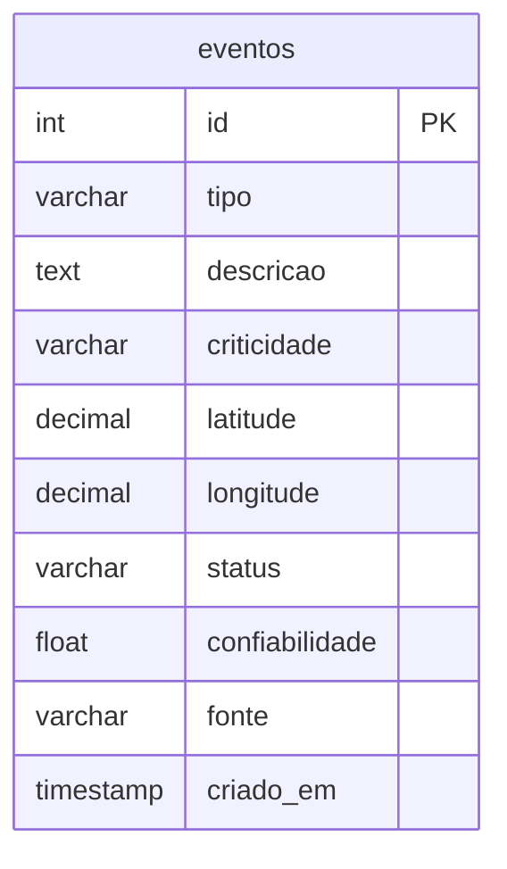

# Diagrama — fase fundação

```mermaid
erDiagram
    eventos {
        int id PK
        varchar tipo
        text descricao
        varchar criticidade
        decimal latitude
        decimal longitude
        varchar status
        float confiabilidade
        varchar fonte
        timestamp criado_em
    }
```

Schema estendido (fases futuras): ver `schema_extended.sql` e `backend/app/models/legacy/`.
