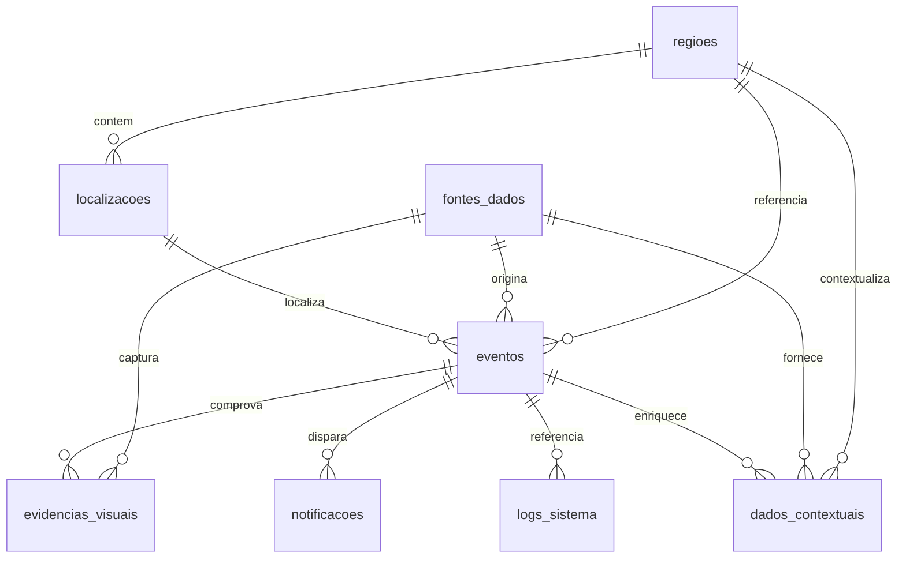

# Diagrama entidade-relacionamento

| Tabela | Função |
|--------|--------|
| `regioes` | Divisão geográfica da cidade |
| `localizacoes` | Coordenadas e endereço normalizados |
| `fontes_dados` | Sensores, APIs, YOLO, fusão, manual |
| `eventos` | Ocorrência urbana |
| `evidencias_visuais` | Imagens/vídeos e detecções YOLO |
| `dados_contextuais` | Clima, trânsito e dados auxiliares |
| `notificacoes` | Alertas enviados por canal |
| `logs_sistema` | Auditoria e diagnóstico |
