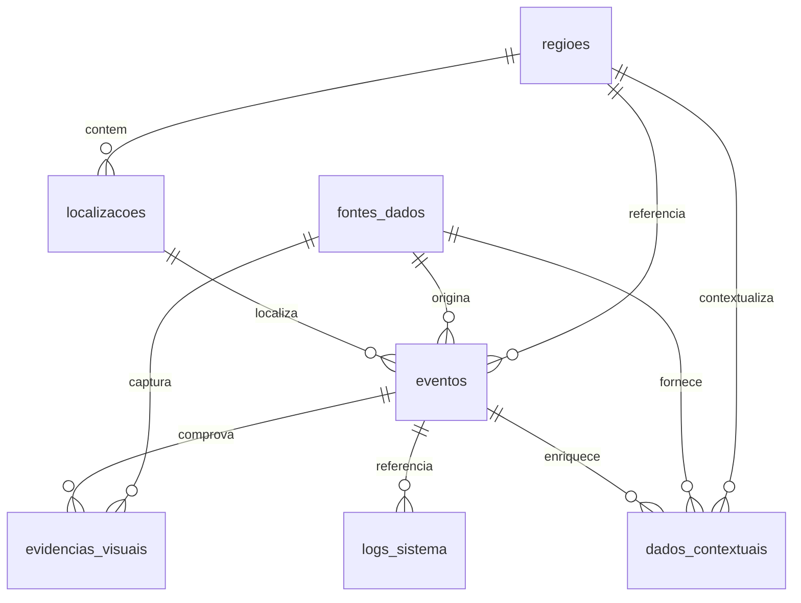

# Banco de dados

[← voltar ao README](../README.md#documentação)

## 6. Banco de dados

SQLite em tudo que roda hoje: local, testes e Cloud Run (lá o banco mora dentro do container e
recomeça vazio a cada revisão — ver [§21](deploy.md#21-deploy-no-google-cloud-run)).
`database/schema.sql` e `database/migrations/` descrevem o mesmo schema em MySQL 8, que
continua suportado via `DATABASE_URL`. Com SQLite,
`main.py` cria as tabelas no startup e `database.py` liga `PRAGMA journal_mode=WAL` +
`busy_timeout=30000` — as threads de monitoramento escrevem em paralelo com as requisições
HTTP e sem isso o SQLite erra `database is locked`.

### Diagrama entidade-relacionamento

### Tabelas

| Tabela | Model | Função |
|---|---|---|
| `regioes` | `Regiao` | Divisão geográfica da cidade (nome, código, polígono GeoJSON opcional). |
| `localizacoes` | `Localizacao` | Coordenadas + endereço. A detecção cria uma localização 1:1 por evento; a retenção apaga as órfãs. |
| `fontes_dados` | `FonteDados` | Origem do evento — na prática, uma fonte `yolo` por câmera. O **tipo** `yolo` é o que permite rebaixar automaticamente um evento `ativo`. |
| `eventos` | `Evento` | Ocorrência urbana. Campos-chave: `tipo`, `severidade`, `status`, `confianca` (score do Data Fusion), `detectado_em`. |
| `evidencias_visuais` | `EvidenciaVisual` | Imagem/frame + `modelo_ia`, `classe_detectada`, `confianca`, `bbox` e SHA-256 do original em `metadados`. |
| `dados_contextuais` | `DadoContextual` | Pares chave/valor por evento. Categoria `contexto` alimenta a dimensão de contexto da fusão. |
| `logs_sistema` | `LogSistema` | Diagnóstico. A fusão grava aqui (com os componentes) só quando promove ou rebaixa um evento. |

### Enums do domínio

- **Severidade**: `baixa` · `media` · `alta` · `critica`
- **Status do evento**: `em_analise` · `ativo`
- **Tipo de evidência**: `imagem` · `video` · `frame` · `thumbnail`
- **Nível de log**: `DEBUG` · `INFO` · `WARN` · `ERROR` · `CRITICAL`

Validados como `Literal[...]` nos schemas Pydantic (`backend/app/schemas/evento.py`), então
um valor fora da lista é rejeitado com 422 antes de chegar ao banco.

### Migrações (`database/migrations/`)

| Arquivo | Tipo | O que faz |
|---|---|---|
| `001_security.sql` | aditiva | Criava `usuarios` e `auditoria_acoes`. **Histórica** — a camada de autenticação foi removida depois. |
| `002_ocorrencias_externas.sql` | aditiva | Cria `ocorrencias_externas` (dedup de datasets externos). |
| `003_remove_auth.sql` | **destrutiva** | Dropa `auditoria_acoes` e depois `usuarios` (nessa ordem — FK). Reverter = reaplicar a `001`; os dados não voltam. |
| `004_painel_somente_leitura.sql` | **destrutiva** | Dropa `logs_sistema.ip_origem`, que existia para rastrear ação de usuário e nunca foi preenchida. |
| `005_remove_notificacoes.sql` | **destrutiva** | Dropa `notificacoes`. Nada no sistema jamais a preencheu. |
| `006_remove_legado_geosampa_e_resolvido.sql` | **destrutiva** | Dropa `ocorrencias_externas` (sem produtor desde a saída do GeoSampa) e `eventos.resolvido_em` (evento expira e é apagado, nunca é "resolvido"). |

O `schema.sql` **não popula eventos, evidências nem dados contextuais** — só regiões, três
fontes de dados e uma linha de log. Registros de ocorrência só entram por detecção real.
